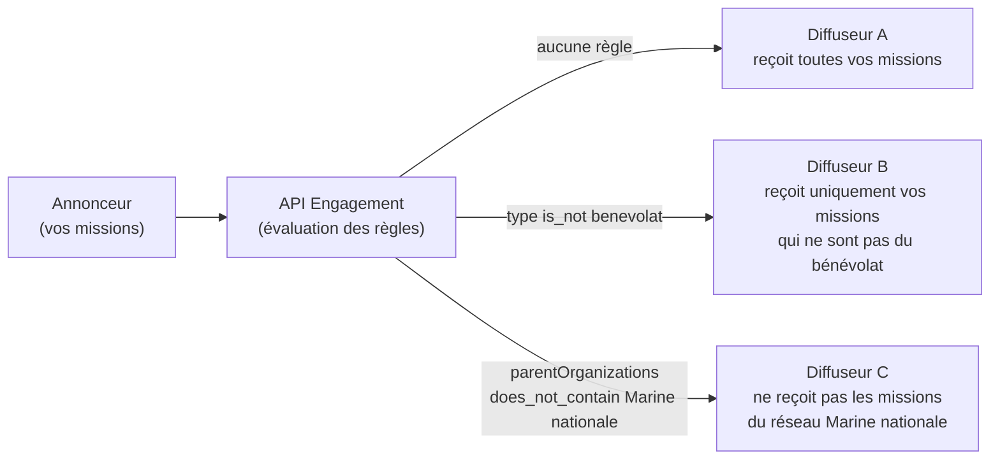
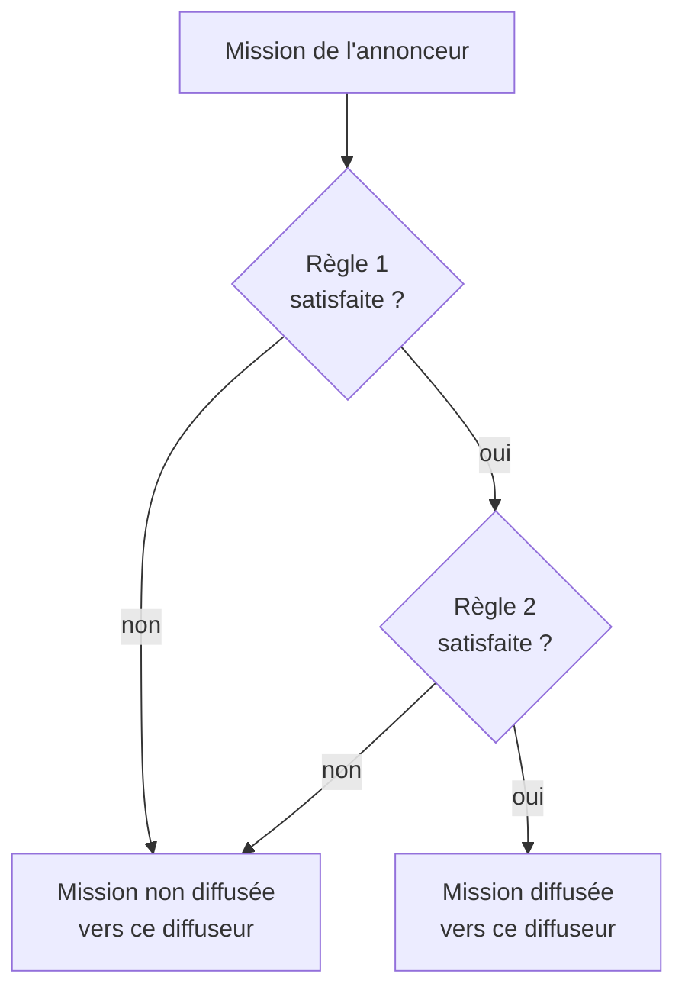

# Comprendre les règles de diffusion

## Le principe

En tant que **partenaire annonceur**, vos missions sont diffusées vers les **partenaires diffuseurs** associés à votre compte. Par défaut, **toutes vos missions sont diffusées vers tous vos diffuseurs**.

Les règles de diffusion vous permettent de restreindre ce comportement : pour chaque diffuseur, vous pouvez définir des conditions que vos missions doivent respecter pour lui être diffusées.



Les règles s'appliquent au moment où le diffuseur récupère les missions via l'API : une mission qui ne respecte pas les règles n'apparaît tout simplement pas dans ses résultats.

## Anatomie d'une règle

Une règle de diffusion compare un **champ** de la mission à une **valeur**, via un **opérateur** :

```json
{
  "publisherIds": ["5f5931496c7ea514150a818f"],
  "field": "type",
  "operator": "is_not",
  "value": "benevolat"
}
```

Cette règle se lit : « Diffuseur les missions à ce diffuseur (`5f5931496c7ea514150a818f`) qui `ne sont pas` de `type` `benevolat` ».

### Combinaison des règles

Lorsque plusieurs règles sont configurées pour un même diffuseur, une mission doit **toutes** les satisfaire pour être diffusée (combinaison en `ET`) :



Les règles sont définies **par diffuseur** : une règle créée pour le diffuseur A n'a aucun effet sur le diffuseur B. Le endpoint de création accepte cependant plusieurs `publisherIds` pour appliquer la même règle à plusieurs diffuseurs en un seul appel.

## Les champs disponibles (`field`)

| Champ                                       | Description                                                                                                     | Exemple de valeur                          |
| ------------------------------------------- | --------------------------------------------------------------------------------------------------------------- | ------------------------------------------ |
| `type`                                      | Type de la mission                                                                                              | `benevolat`, `volontariat_service_civique` |
| `publisherOrganizationId`                   | Identifiant API Engagement de l'organisation porteuse de la mission                                             | `9b1c2d3e-4f56-7890-abcd-ef0123456789`     |
| `publisherOrganization.clientId`            | Identifiant de l'organisation dans **votre** système (celui que vous transmettez à la création de vos missions) | `12345`                                    |
| `publisherOrganization.parentOrganizations` | Réseaux / organisations parentes de l'organisation porteuse (champ **tableau**)                                 | `Marine nationale`                         |

## Les opérateurs (`operator`)

| Opérateur          | La mission est diffusée si…                                  |
| ------------------ | ------------------------------------------------------------ |
| `is`               | le champ est égal à la valeur                                |
| `is_not`           | le champ est différent de la valeur                          |
| `contains`         | le champ contient la valeur (insensible à la casse)          |
| `does_not_contain` | le champ ne contient pas la valeur (insensible à la casse)   |
| `starts_with`      | le champ commence par la valeur (insensible à la casse)      |
| `is_greater_than`  | le champ est strictement supérieur à la valeur               |
| `is_less_than`     | le champ est strictement inférieur à la valeur               |
| `exists`           | le champ est renseigné (la valeur fournie est ignorée)       |
| `does_not_exist`   | le champ n'est pas renseigné (la valeur fournie est ignorée) |


**Cas particulier des champs tableau** (`publisherOrganization.parentOrganizations`) : `is` et `contains` testent la **présence exacte** de la valeur dans le tableau (insensible à la casse), `is_not` et `does_not_contain` testent son absence. Il n'y a pas de correspondance par sous-chaîne : `does_not_contain "Marine"` n'exclut pas une mission dont le réseau est `Marine nationale`.


## Vérifier si une valeur est diffusée (`field` / `value` et le booléen `diffuse`)

Le endpoint [Lister les règles de diffusion](liste.md) accepte deux paramètres de requête optionnels, `field` et `value`, à fournir **ensemble** (les deux ou aucun, sinon l'API renvoie une erreur `400`).

Lorsqu'ils sont fournis, chaque diffuseur retourné est annoté d'un booléen `diffuse` qui répond à la question : **« ce diffuseur diffuserait-il une mission portant cette valeur sur ce champ ? »**

```
GET /v0/diffusion-rule?field=publisherOrganization.parentOrganizations&value=Marine nationale
```

```json
{
  "ok": true,
  "total": 2,
  "data": [
    {
      "id": "5f5931496c7ea514150a818f",
      "name": "Diffuseur A",
      "rules": [],
      "diffuse": true
    },
    {
      "id": "60a1b2c3d4e5f6789abc0001",
      "name": "Diffuseur B",
      "rules": [
        {
          "id": "9b1c2d3e-4f56-7890-abcd-ef0123456789",
          "field": "publisherOrganization.parentOrganizations",
          "fieldType": "string",
          "operator": "does_not_contain",
          "value": "Marine nationale"
        }
      ],
      "diffuse": false
    }
  ]
}
```

Le calcul de `diffuse` ne considère que les **règles d'exclusion** portant sur le champ demandé :

- `is_not` : `diffuse` vaut `false` si la valeur recherchée est égale à la valeur de la règle ;
- `does_not_contain` : `diffuse` vaut `false` si la valeur de la règle est contenue dans la valeur recherchée (présence exacte pour les champs tableau) ;
- `does_not_exist` : `diffuse` vaut `false` dès qu'une valeur est recherchée sur ce champ.

Les comparaisons sont insensibles à la casse. S'il n'existe aucune règle d'exclusion sur ce champ pour le diffuseur, `diffuse` vaut `true`.

## Exemples de règles courantes

**Ne pas diffuser les missions de bénévolat vers un diffuseur :**

```json
{ "publisherIds": ["..."], "field": "type", "operator": "is_not", "value": "benevolat" }
```

**Ne diffuser que les missions d'une organisation précise :**

```json
{ "publisherIds": ["..."], "field": "publisherOrganizationId", "operator": "is", "value": "9b1c2d3e-..." }
```

**Exclure les missions d'un réseau (organisations parentes) :**

```json
{ "publisherIds": ["..."], "field": "publisherOrganization.parentOrganizations", "operator": "does_not_contain", "value": "Marine nationale" }
```
